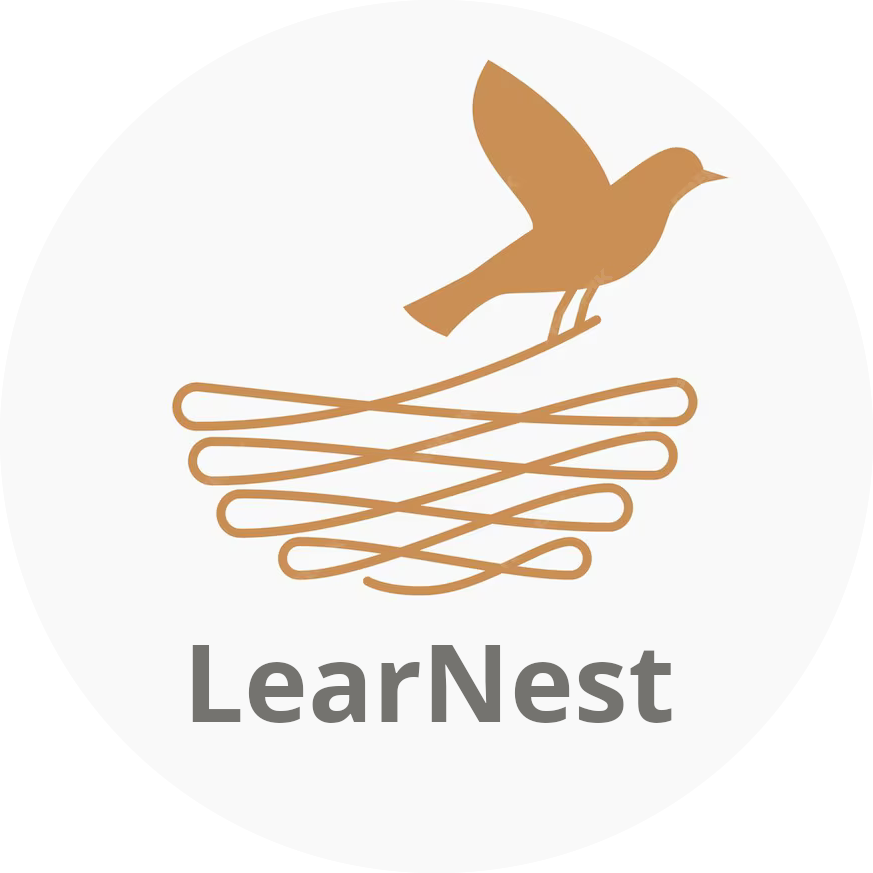

<!-- PROJECT LOGO -->
<br />
<div align="center">
  <a href="https://github.com/dmastr/learnest_django">
    
  </a>

  <h3 align="center">LearNest</h3>

  <p align="center">
    LearNest is a website for teachers and tutors 
    for managing work with students.
  </p>
</div>


## About The Project

Users can add students, packages of lessons 
and then them to their students. 
Also you can keep track of how many lessons from each package student has spent.


## Built With

* [![Python 3.12][Python-image]][Python-url]
* [![Django][Django-image]][Django-url]
* [![SQLite][SQLite-image]][SQLite-url]
* [![HTML5][HTML5-image]][HTML5-url]
* [![Bootstrap][Bootstrap-image]][Bootstrap-url]

## Installing

### Requirements

* [Python](https://python.org) 3.6 or newer


### Fork and clone the repository

First fork the project using GitHub, than clone it locally:

```console
git clone https://github.com/<username>/learnest_django.git
cd learnest_django
```


### Create virtual environment and install dependencies

Using venv create virtual environment in the `.env` folder
and activate it

Example for windows

```console
py -m venv .env
.env/Scripts/activate
pip install -r requirements.txt
```


### Initialize the database

```console
py manage.py createsuperuser --username admin --email admin@email.com
py manage.py migrate
```

### Run project locally

It will be available at http://127.0.0.1:8000/

```console
py manage.py runserver
```


<!-- MARKDOWN LINKS & IMAGES -->
[Python-image]: https://img.shields.io/badge/python-3670A0?style=for-the-badge&logo=python&logoColor=ffdd54
[Python-url]: https://www.python.org/
[Django-url]: https://www.djangoproject.com/
[Django-image]: https://img.shields.io/badge/Django-092E20?style=for-the-badge&logo=django&logoColor=green
[SQLite-image]: https://img.shields.io/badge/SQLite-blue?logo=sqlite&logoColor=white
[SQLite-url]: https://www.sqlite.org/
[Bootstrap-image]: https://img.shields.io/badge/Bootstrap-563D7C?style=for-the-badge&logo=bootstrap&logoColor=white
[Bootstrap-url]: https://getbootstrap.com
[HTML5-url]: https://developer.mozilla.org/en-US/docs/Glossary/HTML5
[HTML5-image]: https://img.shields.io/badge/html5-3670A0?style=for-the-badge&logo=html5&logoColor=red